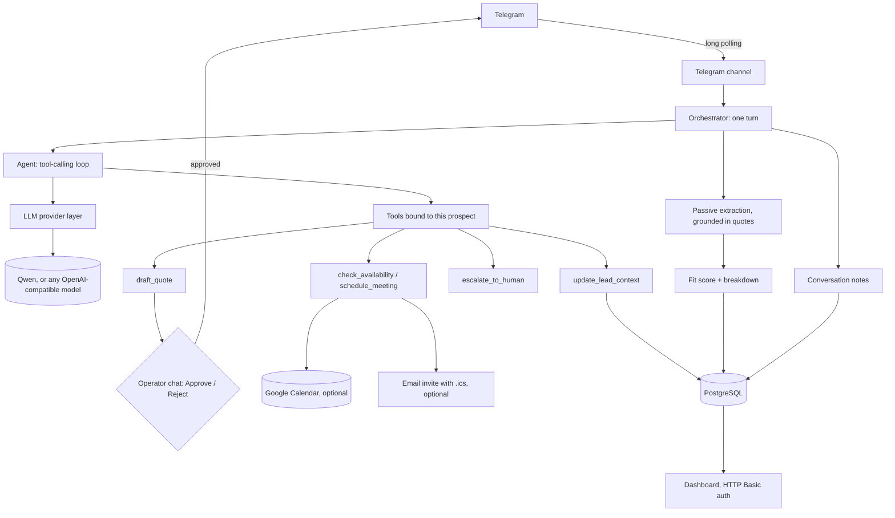

# Cygne — Architecture

## Overview

Cygne answers a marketing agency's inbound leads on Telegram. It holds the conversation,
learns what the prospect needs, scores the lead, drafts a proposal that a person approves
before it is sent, and books a call. Everything is stored in Postgres and visible on a
password-protected dashboard.

The agent core does not know which LLM it talks to, which channel a message came from, or
how data is stored; each of those is a boundary with its own module.

## Components

| Module                    | Responsibility                                                         |
|---------------------------|-------------------------------------------------------------------------|
| `cygne.channels.telegram` | Long-polling bot, replies, quote approval buttons in the operator chat. |
| `cygne.orchestrator`      | One turn: load state, run the agent, save, extract, score, update notes. |
| `cygne.agent`             | The system prompt and the tool-calling loop.                           |
| `cygne.llm`               | Provider interface; Qwen and OpenAI-compatible implementations.         |
| `cygne.tools`             | Tools, built per turn and bound to the prospect being served.           |
| `cygne.leads`             | Grounded extraction, the fit score, de-duplication.                     |
| `cygne.memory`            | Recent-message history, running notes, prompt context.                 |
| `cygne.scheduling`        | Open slots and booking, across Google Calendar, email and the DB.       |
| `cygne.db`                | SQLAlchemy models, async session, query helpers.                       |
| `cygne.dashboard`         | Password-protected view of leads, scores and meetings.                 |
| `cygne.config`            | Typed settings; nothing else reads the environment.                    |

## A turn

1. The message is stored, and the prospect's record and recent history are loaded.
2. The agent gets a system prompt rendered for this prospect: what is known, what is still
   missing, and the rules. It replies, calling tools as needed.
3. The reply is stored. If the model ended its turn after a tool call without writing
   anything (some models do), it is asked once more for the message alone, with no tools,
   so nothing runs twice; a short fallback covers the case where that fails too.
4. Passive extraction reads the prospect's recent messages and saves the facts that pass
   the evidence check (below), then the lead is re-scored.
5. Every `SUMMARY_THRESHOLD` messages, the newest messages are folded into the
   conversation notes.

## Design decisions

**Extraction is checked against the prospect's words, not the model's confidence.** The
extraction model must return, for each fact, the exact words it was taken from. A fact is
kept only if those words appear in the prospect's messages (allowing for case and
punctuation) and agree with the value: an email must be inside its quote, a budget must
match the amount quoted (or be a yearly amount turned monthly). Facts invented by the
model, or taken from the assistant's own questions, have no quote to point to and are
dropped and logged. A model's stated confidence can't be checked; a quote can.

**The score explains itself.** Five signals, each worth a share of 100: need (25),
budget against the agency's minimum engagement (30, `CYGNE_MIN_MONTHLY_BUDGET`), timeline
urgency (20), authority (15) and reachability (10). Partial information earns partial
points, and the per-signal breakdown is stored and shown on the dashboard, so an operator
can see why a lead is "high" and what is missing. Tiers: high at 65, medium at 40, low at 15.

**A person approves every proposal.** `draft_quote` only stores a pending quote and posts
it to the operator chat with Approve and Reject buttons. Only an approval sends it to the
prospect. Callback data comes from the client and can be forged, so decisions are accepted
only from the operator chat.

**The model never does date arithmetic.** `check_availability` returns labelled slots
("Tuesday, June 23 at 16:00") in the business timezone, and `schedule_meeting` books by
that exact label, after the prospect has agreed, picked a slot and given an email.

**Tools are bound per prospect.** Each turn builds the tools with the prospect's id inside
them, so the model has no parameter it could use to act on someone else's record.

**The dashboard is closed by default.** It lists contact details, so it requires HTTP
Basic auth and does not open at all until `CYGNE_DASHBOARD_PASSWORD` is set.

**Optional integrations degrade gracefully.** Without Google Calendar credentials,
meetings are booked in the database; without SMTP, the email invite is skipped.

## Deployment

`docker compose up` runs Postgres, the bot and the dashboard. The bot uses long polling,
so it needs no public URL or TLS; only the dashboard listens on a port. Tables are created
on start. The image runs as an unprivileged user.
